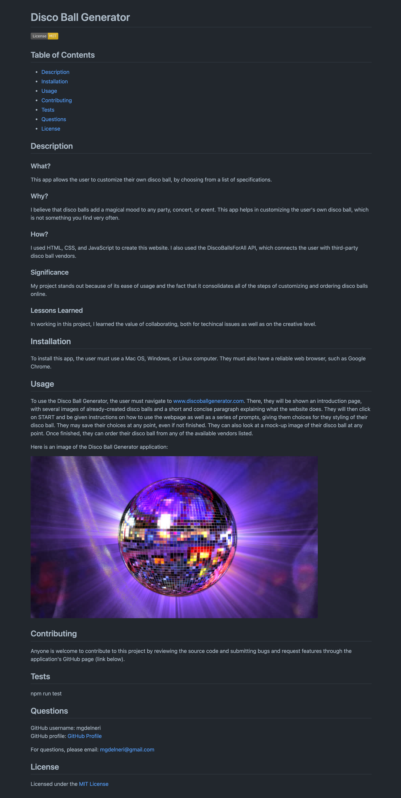

# Professional-README-Generator

## GOAL

The goal of this project was to create a command-line application that dynamically generates a professional README.md file. To generate a README.md file, this application uses user input as prompted in the terminal. 

In order to create these prompts, we were to use the Inquirer package through Node JS. The sections for the generated README.md file were assigned as: Table of Contents, Description, Installation, Usage, Contributing, Tests, and License. We were also required to generate a license badge (to appear at the top of the document) and a license link (to appear in the License section of the README.md file). Under the Questions section, we were to have a GitHub profile link and email address listed. 

We were given minor starter code in both an index.js and a generateMarkdown.js files. 

## PROCESS

In order to tackle this project, I spent a good amount of time reviewing the requirements, planning, and mapping out what should be done. As there were specific instructions for setting up the repo in VS Code, I went through those carefully and in order, so it would be set up correctly. 

On paper, I wrote down a to-do list, to organize my process and help wrap my mind around how this app was to be created. I also penned down on paper a mock-up of the generated README, with all of the required sections. 

Once I decided to tackle coding, I wrote out the questions to appear as prompts in the command line in index.js, by using the format for the Inquirer package. After this, I went over to the generateMarkdown.js file and started writing out the markdown elements in the generateMarkdown function. At this point, I made sure to test the application in the command line before continuing with coding the other sections. For this, I used console.log to make sure I was getting the desired data from the functionality. 

To fully understand the logic behind the code for this application, I got together with a study group and also met up with my tutor. In talking it over, we deciphered what the starter code was hinting at, and I was able to complete the functions that generate license badges and license links, as well as connect all of the functions together to successfully generate a README. 

Once all code was in place, I ran it a few times to make sure it was working as desired, and tweaked a few things along the way. Lastly, I recorded a walkthrough video showing the app's functionality, as shown below. It should be noted that the answers for the prompts in the walkthrough video are for a fake application, and it was being used solely to show the README generator's functionality. 

Here is the link for the walkthrough video for the Professional-README-Generator: 

[Professional README Generator Walkthrough Video](https://drive.google.com/file/d/1QNfESasexFu_FbaEWoTYlSJh6k86wLI1/view)

Here is an image of the generated README in the walkthrough video, with information about the "Disco Ball Generator", a fake application: 

## INSTALLATION

In order to use this application, the user must have Node JS installed in their computer. Preferably the user is using a Mac OS, Windows, or Linux machine. 

## USAGE

In order to use the Professional README Generator, the user must find the relevant folder for this application in the command line. As soon as it is pointing to the appropriate folder, the user should type "node index.js" in the command line, which will bring up a series of prompts. After completing all of the prompts, a README should be generated for their project with the information provided. 

## CONCLUSION

This is our first back-end assignment, and the first time I have been exposed to anything relating to back-end coding. This was thus a very challenging assignment. 

The value of collaboration was made obvious throughout the process of creating and fine-tuning this application. I also realized that there is value in both peer collaboration (classmates who are at around the same level of coding as me) and tutor collaboration (someone who has had a lot of experience with coding). 

It was also very interesting to use JavaScript in the back-end for the first time. It showcased the expanded abilities and versatility of the JavaScript language.  

As usual, an application never feels quite done. Even though it has all of the assignement requirements within it, given more time, I would add more styling and more features to the README markdown. 

